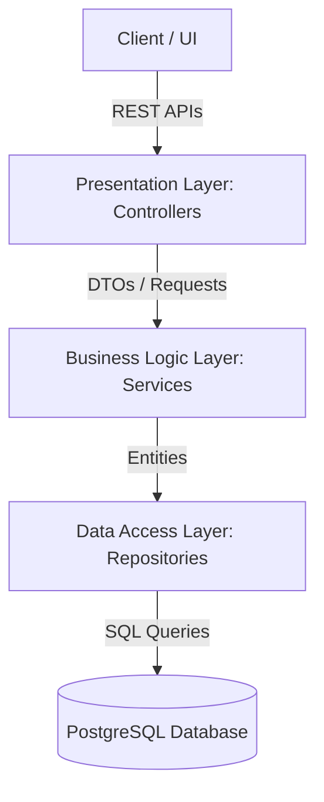
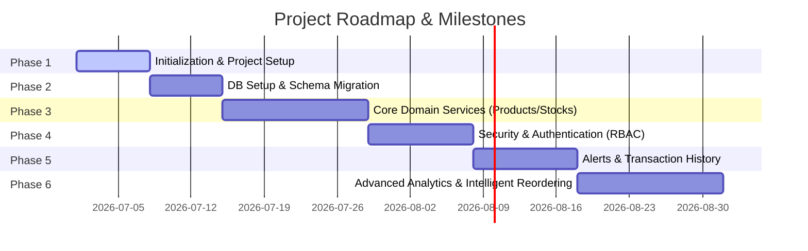

# Smart Inventory Management System

A modern, robust, and automated Inventory Management System built on Spring Boot 3.x and Java 17, designed to streamline and automate stock control, tracking, and warehouse workflows.

---

## 🚀 Features

- **Real-Time Stock Tracking:** Accurate monitoring of inventory levels, locations, and status.
- **Role-Based Access Control:** Secure user permissions for administrators, inventory managers, and staff.
- **Automated Alerts:** Low stock alerts and notification triggers to prevent supply chain disruptions.
- **Flyway Migrations:** Consistent database schema evolution across environments.
- **RESTful API:** Clean, validated endpoints for integration with frontend and external systems.
- **Reporting & Dashboard:** Stock value/movement reports plus a dashboard summary of counts, low-stock items, and recent activity, with downloadable CSV export of the product inventory.
- **Purchase Orders:** Raise supplier purchase orders with line items and drive their lifecycle (draft → placed → received), with received goods flowing through the stock-movement audit trail.

---

## 🛠️ Technology Stack

| Technology | Purpose |
| :--- | :--- |
| **Java 17** | Core programming language |
| **Spring Boot 4.1.0** | Main framework (Web MVC, JPA, Security, Validation) |
| **PostgreSQL** | Primary relational database |
| **Flyway** | Database migration engine |
| **Lombok** | Boilerplate code reduction |
| **Maven** | Dependency management & build tool |

---

## 🏛️ Architecture & Project Structure

The project follows a standard **Layered (Three-Tier) Architecture** to ensure separation of concerns, scalability, and ease of testing.



### Folder & Package Layout

```text
smart-inventory-management-system/
├── src/
│   ├── main/
│   │   ├── java/com/example/smartinventory/
│   │   │   ├── config/          # Configurations (Security, Spring MVC, CORS)
│   │   │   ├── controller/      # REST API Controllers (endpoints)
│   │   │   ├── dto/             # Data Transfer Objects (request/response models)
│   │   │   ├── exception/       # Custom exceptions & global handler
│   │   │   ├── model/           # JPA Entities (database mappings)
│   │   │   ├── repository/      # Spring Data JPA Repository interfaces
│   │   │   └── service/         # Business logic Services (interfaces & impls)
│   │   └── resources/
│   │       ├── db/migration/    # Flyway migration scripts (SQL)
│   │       └── application.properties
│   └── test/
│       └── java/com/example/smartinventory/  # Unit & Integration tests
```

---

## 🎯 Project Roadmap



- [x] **Phase 1: Project Initialization & Directory Layout** (Done)
- [ ] **Phase 2: Database Setup & Flyway Migration** (Upcoming)
  - Configure connection pool and profiles.
  - Establish base SQL tables (products, suppliers, users, transactions).
- [ ] **Phase 3: Core Domain Services**
  - Implement CRUD APIs for Products, Suppliers, and Inventory.
- [ ] **Phase 4: Security & Authentication (RBAC)**
  - JWT integration and Spring Security policies.
- [ ] **Phase 5: Alerts & Transaction History**
  - Implement email notifications/event streams for low stock items.
- [ ] **Phase 6: Advanced Analytics & Intelligent Reordering**
  - Predictive demand planning and automated ordering integrations.

---

## ⚙️ Getting Started

### Prerequisites

- Java JDK 17 or higher
- PostgreSQL (running locally or via Docker)
- Maven 3.8+ (or using the Maven Wrapper included)

### Building the Project

Run the following command to compile and build the package:

```bash
./mvnw clean install
```

### Running the Application

To start the application locally:

```bash
./mvnw spring-boot:run
```
