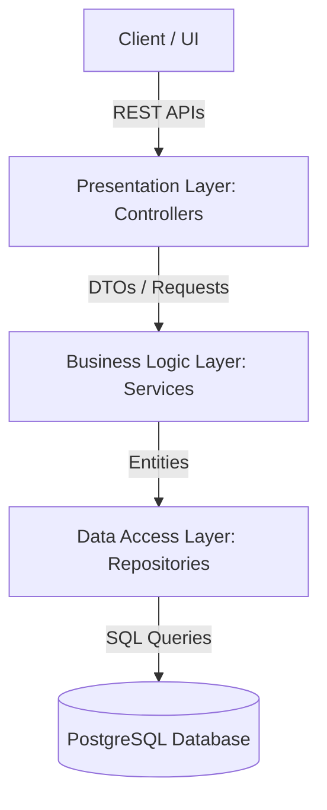
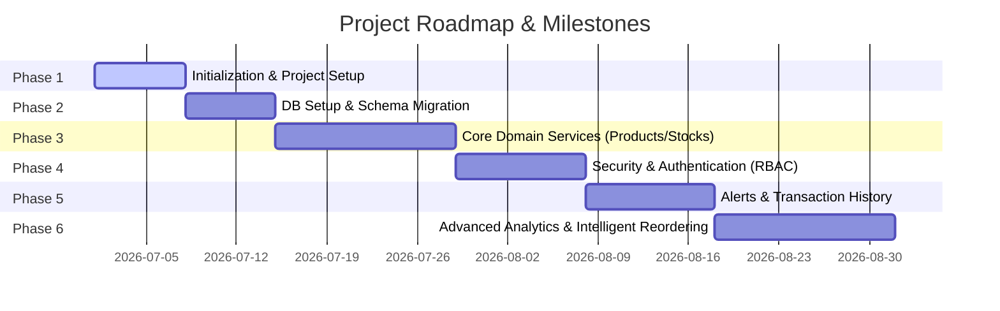

# Smart Inventory Management System

[](https://github.com/monssefbaakka/smart-inventory-management-system/actions/workflows/ci.yml)
[](LICENSE)
[](CHANGELOG.md)
[](https://openjdk.org/projects/jdk/17/)
[](https://spring.io/projects/spring-boot)

A modern, robust, and automated Inventory Management System built on Spring Boot 3.x and Java 17, designed to streamline and automate stock control, tracking, and warehouse workflows.

---

## 🚀 Features

- **Real-Time Stock Tracking:** Accurate monitoring of inventory levels, locations, and status.
- **Role-Based Access Control:** Secure user permissions for administrators, inventory managers, and staff.
- **Automated Alerts:** Low stock alerts and notification triggers to prevent supply chain disruptions.
- **Flyway Migrations:** Consistent database schema evolution across environments.
- **RESTful API:** Clean, validated endpoints for integration with frontend and external systems.
- **Reporting & Dashboard:** Stock value/movement reports plus a dashboard summary of counts, low-stock items, and recent activity, with downloadable CSV export of the product inventory and stock-movement history.
- **Purchase Orders:** Raise supplier purchase orders with line items and drive their lifecycle (draft → placed → received), with received goods flowing through the stock-movement audit trail.
- **Automatic Reordering:** Stock reaching its reorder threshold raises a draft purchase order against the product's supplier, so a buyer only reviews and places it.
- **Interactive API Docs:** Swagger UI and an OpenAPI 3 specification document every endpoint, with a built-in JWT **Authorize** button for trying protected routes.
- **API Rate Limiting:** Per-caller request budget over `/api/**` that returns `429 Too Many Requests` once exhausted.
- **Multi-Warehouse Stock:** Track how much of each product sits in each stocking location, with movements applied to a named warehouse.
- **Stock Transfers:** Move goods between warehouses in one call; both locations change by equal and opposite amounts and the product's overall quantity stays put.
- **Stocktake / Cycle Counting:** Count a warehouse line by line, see the variance against what the system expected, then commit the whole count as one reconciliation.
- **Batch & Expiry Tracking:** Track stock in lots with their own expiry dates, consume them earliest-expiry-first, and report what is expiring soon or already expired.
- **Barcode & QR Support:** Products carry a scannable barcode, resolve by scan in a single lookup, and render printable Code 128 or QR labels as PNG.
- **Multi-Tenancy:** One deployment serves many organisations; every row carries its tenant and every query is scoped to the caller's tenant, so tenants never see each other's inventory.

---

## 🛠️ Technology Stack

| Technology | Purpose |
| :--- | :--- |
| **Java 17** | Core programming language |
| **Spring Boot 4.1.0** | Main framework (Web MVC, JPA, Security, Validation) |
| **PostgreSQL** | Primary relational database |
| **Flyway** | Database migration engine |
| **Lombok** | Boilerplate code reduction |
| **Maven** | Dependency management & build tool |

---

## 🏛️ Architecture & Project Structure

The project follows a standard **Layered (Three-Tier) Architecture** to ensure separation of concerns, scalability, and ease of testing.


```mermaid
graph TD
    Client[Client / UI] -->|REST APIs| Controller[Presentation Layer: Controllers]
    Controller -->|DTOs / Requests| Service[Business Logic Layer: Services]
    Service -->|Entities| Repository[Data Access Layer: Repositories]
    Repository -->|SQL Queries| DB[(PostgreSQL Database)]
```

### Folder & Package Layout

```text
smart-inventory-management-system/
├── src/
│   ├── main/
│   │   ├── java/com/example/smartinventory/
│   │   │   ├── config/          # Configurations (Security, Spring MVC, CORS)
│   │   │   ├── controller/      # REST API Controllers (endpoints)
│   │   │   ├── dto/             # Data Transfer Objects (request/response models)
│   │   │   ├── exception/       # Custom exceptions & global handler
│   │   │   ├── model/           # JPA Entities (database mappings)
│   │   │   ├── repository/      # Spring Data JPA Repository interfaces
│   │   │   └── service/         # Business logic Services (interfaces & impls)
│   │   └── resources/
│   │       ├── db/migration/    # Flyway migration scripts (SQL)
│   │       └── application.properties
│   └── test/
│       └── java/com/example/smartinventory/  # Unit & Integration tests
```

---

## 🎯 Project Roadmap


```mermaid
gantt
    title Project Roadmap & Milestones
    dateFormat  YYYY-MM-DD
    section Phase 1
    Initialization & Project Setup :active, 2026-07-01, 7d
    section Phase 2
    DB Setup & Schema Migration : 2026-07-08, 7d
    section Phase 3
    Core Domain Services (Products/Stocks) : 2026-07-15, 14d
    section Phase 4
    Security & Authentication (RBAC) : 2026-07-29, 10d
    section Phase 5
    Alerts & Transaction History : 2026-08-08, 10d
    section Phase 6
    Advanced Analytics & Intelligent Reordering : 2026-08-18, 14d
```

- [x] **Phase 1: Project Initialization & Directory Layout** (Done)
- [ ] **Phase 2: Database Setup & Flyway Migration** (Upcoming)
  - Configure connection pool and profiles.
  - Establish base SQL tables (products, suppliers, users, transactions).
- [ ] **Phase 3: Core Domain Services**
  - Implement CRUD APIs for Products, Suppliers, and Inventory.
- [ ] **Phase 4: Security & Authentication (RBAC)**
  - JWT integration and Spring Security policies.
- [ ] **Phase 5: Alerts & Transaction History**
  - Implement email notifications/event streams for low stock items.
- [ ] **Phase 6: Advanced Analytics & Intelligent Reordering**
  - Predictive demand planning and automated ordering integrations.

---

## ⚙️ Getting Started

### Prerequisites

- Java JDK 17 or higher
- PostgreSQL (running locally or via Docker)
- Maven 3.8+ (or using the Maven Wrapper included)

### Building the Project

Run the following command to compile and build the package:

```bash
./mvnw clean install
```

### Running the Application

To start the application locally:

```bash
./mvnw spring-boot:run
```

### Rate Limiting

Requests to `/api/**` are throttled per caller — by authenticated username when a valid token is
present, otherwise by remote address. Each response carries `X-RateLimit-Limit` and
`X-RateLimit-Remaining`; once the budget is exhausted the API answers `429 Too Many Requests` with a
`Retry-After` header.

| Property | Environment variable | Default | Purpose |
| :--- | :--- | :--- | :--- |
| `rate-limit.enabled` | `RATE_LIMIT_ENABLED` | `true` | Switches rate limiting on or off |
| `rate-limit.requests` | `RATE_LIMIT_REQUESTS` | `100` | Requests allowed per caller per window |
| `rate-limit.window-seconds` | `RATE_LIMIT_WINDOW_SECONDS` | `60` | Length of the refill window in seconds |

Counters are held in memory, so each application instance enforces its own budget.

### Automatic Reordering

Every stock movement is checked against the product's `reorderThreshold`. When the movement leaves
the product at or below it, a `DRAFT` purchase order is raised against the product's supplier,
priced at the product's current unit price and flagged `autoGenerated` in the purchase order
response. Nothing is sent anywhere: the draft waits for a buyer to review, place and receive it
through the ordinary purchase order endpoints.

| Property | Environment variable | Default | Purpose |
| :--- | :--- | :--- | :--- |
| `auto-reorder.enabled` | `AUTO_REORDER_ENABLED` | `false` | Switches automatic reordering on or off |

How much is ordered comes from the product's optional `reorderQuantity`. Left unset, the order tops
stock back up to twice the reorder threshold — a product with a threshold of 10 sitting at 3 units is
ordered 17.

```json
PUT /api/products/1
{
  "name": "Widget",
  "sku": "SKU-1",
  "price": 19.99,
  "quantity": 3,
  "reorderThreshold": 10,
  "reorderQuantity": 50,
  "supplier": { "id": 2 }
}
```

The rule deliberately raises at most one order per shortfall:

- A product already sitting on an open (`DRAFT` or `PLACED`) purchase order is skipped, so a
  shortfall that develops over several movements still produces a single order. Receiving that order
  ends the skip.
- A product with no supplier is skipped and logged — there is nobody to order from.

### Warehouses & Stock Levels

Warehouses are stocking locations, each with a unique `code`. A stock movement may name a warehouse
(`warehouseId` in the movement payload): the movement is then applied to that warehouse's level *and*
to the product's overall quantity, so a product's total stays the sum of what the locations hold.
Movements recorded without a warehouse change the overall quantity only.

| Endpoint | Purpose |
| :--- | :--- |
| `POST/PUT/DELETE /api/warehouses` | Manage warehouses (ADMIN) |
| `GET /api/warehouses` · `GET /api/warehouses/{id}` | Read warehouses |
| `GET /api/warehouses/{id}/stock` | Everything stocked in one warehouse |
| `GET /api/products/{id}/stock` | One product's stock, broken down by warehouse |

An `OUT` movement against a warehouse is rejected with `409 Conflict` when that location holds too
little stock, even if the product has enough elsewhere.

### Stock Transfers

A transfer moves stock between two warehouses in a single call. It changes *where* the stock is, not
how much of it exists: the source level drops, the destination level rises by the same amount, and
the product's overall quantity is untouched. Both legs are written to the movement history as
`TRANSFER_OUT` and `TRANSFER_IN`, so every level change is still explained by a movement row.

| Endpoint | Purpose |
| :--- | :--- |
| `POST /api/stock-transfers` | Move stock between two warehouses (ADMIN) |
| `GET /api/stock-transfers` | Transfer history, most recent first |
| `GET /api/stock-transfers?productId={id}` | Transfers of one product |
| `GET /api/stock-transfers?warehouseId={id}` | Transfers into *or* out of one warehouse |
| `GET /api/stock-transfers/{id}` | A single transfer |

```json
POST /api/stock-transfers
{
  "productId": 1,
  "sourceWarehouseId": 1,
  "destinationWarehouseId": 2,
  "quantity": 10,
  "note": "Rebalancing after regional demand spike"
}
```

Transfers are rejected with `400 Bad Request` when both sides name the same warehouse or the
destination is inactive, and with `409 Conflict` when the source location holds too little. Moving
stock *out of* an inactive warehouse stays allowed, so a site being wound down can be drained.
`TRANSFER_IN` and `TRANSFER_OUT` are not accepted by the ordinary movement endpoint — they always
come in pairs and are written only by a transfer.

### Stocktake / Cycle Counting

A stock count reconciles one warehouse against what the system believes it holds. Counts are entered
while the count is `DRAFT` and touch no stock; each line snapshots the expected quantity when it is
entered, so the variance (`counted - expected`) is visible before anything is committed. Completing
the count applies every line as an `ADJUSTMENT` against the counted warehouse, so the per-warehouse
level *and* the product's overall quantity settle on the counted figure, and each correction lands in
the movement history.

| Endpoint | Purpose |
| :--- | :--- |
| `POST /api/stock-counts` | Open a count against a warehouse (ADMIN) |
| `POST /api/stock-counts/{id}/lines` | Record what was found for one product (ADMIN) |
| `POST /api/stock-counts/{id}/complete` | Apply every line to stock and close the count (ADMIN) |
| `POST /api/stock-counts/{id}/cancel` | Abandon a draft count, leaving stock untouched (ADMIN) |
| `GET /api/stock-counts` · `?warehouseId=` · `?status=` | Count history, most recent first |
| `GET /api/stock-counts/{id}` | One count with its lines and variances |

```json
POST /api/stock-counts/3/lines
{
  "productId": 1,
  "countedQuantity": 38
}
```

Counting the same product twice replaces the earlier line — a recount is the normal case, not an
error. Lines may only be added while the count is `DRAFT`, and only a `DRAFT` count can be completed
or cancelled; anything else answers `409 Conflict`, as does completing a count with no lines.

### Batches & Expiry

A batch is a lot of one product: a quantity sharing a lot code and an expiry date, optionally held in
a named warehouse. A recall names a lot rather than a product, and a carton received in March is not
the same stock as one received in July, so lots are tracked separately from the product total.

| Endpoint | Purpose |
| :--- | :--- |
| `POST /api/products/{id}/batches` | Declare a lot of a product (ADMIN) |
| `GET /api/products/{id}/batches` | Every lot of a product, earliest expiry first |
| `GET /api/batches/{id}` | A single lot |
| `GET /api/batches/expiring?days=30` | Lots still holding stock that expire within the window |
| `GET /api/batches/expired` | Lots past their expiry date that still hold stock |
| `DELETE /api/batches/{id}` | Stop tracking an empty lot (ADMIN) |

A lot is declared empty and filled by movements, so what it holds is always explained by the movement
history:

```json
POST /api/products/1/batches
{
  "lotCode": "A-2291",
  "expiryDate": "2026-12-31",
  "warehouseId": 1
}
```

The movement payload takes an optional `batchId`:

- `IN` naming a lot adds to it; `OUT` naming a lot takes from it and is rejected with `409 Conflict`
  when the lot holds too little.
- `OUT` naming no lot is spread across the product's lots **earliest expiry first**, lots with no
  expiry date drawn on last. Naming a warehouse restricts the allocation to the stock held there.
  Availability is summed before anything is deducted, so a movement asking for more than the lots
  hold leaves every one of them untouched.
- `ADJUSTMENT` may not name a lot and leaves the lots alone: it sets an absolute quantity, and which
  lots that figure belongs to is a question only a stocktake can answer.

A lot that belongs to a different product, or is held somewhere other than where the stock moved, is
rejected with `400 Bad Request`. A lot still holding stock cannot be deleted — that stock exists and
has to leave through a movement.

Batch tracking is opt-in per product simply by having lots: a product with none behaves exactly as it
did before, and the movement history records the lot on every movement that named one.

### Barcode & QR Codes

Each product carries an optional `barcode` field (EAN/UPC/Code 128 symbol content, unique across
products). A scanner client posts the scanned value to the lookup endpoint to resolve it to a
product, and label images can be rendered on demand.

| Endpoint | Purpose |
| :--- | :--- |
| `GET /api/products/barcode/{barcode}` | Resolves a scanned symbol to a product; `404` when unknown |
| `GET /api/products/{id}/barcode.png` | Code 128 label as `image/png` |
| `GET /api/products/{id}/qrcode.png` | QR code as `image/png` |

Label endpoints encode the product's `barcode`, falling back to its `sku` when no barcode is
assigned, so every product can be labelled and scanned.

### Multi-Tenancy

A single deployment can serve several organisations. Every tenant-owned table carries a `tenant_id`
column holding the tenant's slug, and Hibernate's discriminator-based multi-tenancy stamps that
value on insert and appends it to every query — isolation is enforced in the persistence layer, not
by each service remembering to filter.

The tenant for a request is the tenant of the authenticated account: the login principal carries it,
a filter binds it to the request thread, and it is unbound again when the request completes. Work
running outside a request (startup, scheduled jobs) falls back to the default tenant.

| Endpoint | Purpose |
| :--- | :--- |
| `POST /api/tenants` | Register a tenant (ADMIN) |
| `GET /api/tenants` · `GET /api/tenants/{id}` | Read the tenant registry (ADMIN) |
| `PUT /api/tenants/{id}` | Rename or deactivate a tenant; the slug is immutable (ADMIN) |
| `GET /api/tenants/current` | The tenant the calling account is scoped to |

```json
POST /api/auth/register
{
  "email": "buyer@acme.example",
  "password": "password123",
  "tenantSlug": "acme"
}
```

Registrations naming no `tenantSlug` join the default tenant, and registering into a deactivated
tenant is rejected with `400 Bad Request`. Business keys are unique *within* a tenant rather than
across the installation — two tenants may both hold SKU `SKU-1` or a category named `Tools` — while
login stays global, since an account's email identifies both the user and the tenant it belongs to.
A resource belonging to another tenant answers `404 Not Found`, exactly as a non-existent one does.

| Property | Environment variable | Default | Purpose |
| :--- | :--- | :--- | :--- |
| `multitenancy.default-tenant` | `DEFAULT_TENANT` | `default` | Tenant used outside requests and for registrations naming none |

The tenant registry spans the whole installation, so managing it is an ADMIN-only operation; every
other endpoint only ever sees the caller's own tenant.

### Paged Listings

Every listing that can grow without bound returns one page at a time, through the same `page` /
`size` / `sort` parameters and the same envelope. Page size defaults to 20 and is capped at 100, so
no single call can pull a whole table:

| Endpoint | Default order | Sortable fields |
| :--- | :--- | :--- |
| `GET /api/products` | `id,asc` | `id`, `name`, `sku`, `price`, `quantity`, `reorderThreshold`, `createdAt`, `updatedAt` |
| `GET /api/products/{id}/movements` | `createdAt,desc` | `id`, `createdAt`, `quantity`, `type` |
| `GET /api/stock-transfers` | `createdAt,desc` | `id`, `createdAt`, `quantity` |
| `GET /api/stock-counts` | `createdAt,desc` | `id`, `createdAt`, `completedAt`, `status` |
| `GET /api/purchase-orders` | `createdAt,desc` | `id`, `createdAt`, `updatedAt`, `status` |
| `GET /api/audit-logs` | `createdAt,desc` | `id`, `createdAt`, `entityType`, `entityId`, `action`, `username` |

The filters each listing already had (`productId`, `warehouseId`, `status`, `supplierId`) still
apply, and combine with paging. A `sort` field outside the listing's own allowlist, a negative
`page`, or a `size` outside `1..100` is a client error and answers `400 Bad Request` — an unknown
field never reaches the database.

The reference-table listings — `/api/categories`, `/api/suppliers`, `/api/warehouses`,
`/api/tenants` — are deliberately unpaged: they are bounded by how many categories or sites an
organisation has.

### Product Listing: Filtering

`GET /api/products` also narrows the catalogue by content:

| Parameter | Default | Purpose |
| :--- | :--- | :--- |
| `search` | — | Case-insensitive text matched against the product name *and* SKU |
| `categoryId` | — | Keeps only products in that category |
| `supplierId` | — | Keeps only products from that supplier |
| `minPrice` / `maxPrice` | — | Keeps only products inside the price band |
| `lowStock` | `false` | Keeps only products at or below their reorder threshold |

Filters are optional and combine with AND, so `?search=widget&categoryId=3&lowStock=true&sort=price,desc`
is a single query. A page comes back inside an envelope carrying the metadata needed to walk the rest:

```json
GET /api/products?page=0&size=2&sort=price,desc
{
  "content": [ { "id": 7, "name": "Widget Pro", "price": 49.99, "…": "…" } ],
  "page": 0,
  "size": 2,
  "totalElements": 137,
  "totalPages": 69,
  "first": true,
  "last": false
}
```

The category and supplier are fetched with the page, so a product listing costs one query regardless
of how many rows it carries. `GET /api/products/low-stock` is unchanged and still returns a plain
array; it is the same result as `?lowStock=true`, without paging.

### Response Shape

Endpoints return response DTOs, never JPA entities. Related records are flattened to their
identifier and a label rather than nested whole, and persistence details such as the `tenant_id`
discriminator stay out of the payload:

```json
GET /api/products/1
{
  "id": 1,
  "name": "Widget",
  "sku": "SKU-1",
  "price": 19.99,
  "quantity": 42,
  "reorderThreshold": 10,
  "categoryId": 3,
  "categoryName": "Tools",
  "supplierId": 2,
  "supplierName": "Acme Supplies"
}
```

The application runs with `spring.jpa.open-in-view=false`, so the persistence session is already
closed by the time a response is written. Mapping to DTOs — and fetching the associations those
DTOs read — is what keeps serialisation off uninitialised proxies.

A product is attached to a category or supplier by naming its id; the named record must exist, or
the request is rejected with `404 Not Found`:

```json
POST /api/products
{
  "name": "Widget",
  "sku": "SKU-1",
  "price": 19.99,
  "quantity": 42,
  "category": { "id": 3 },
  "supplier": { "id": 2 }
}
```

### API Documentation (Swagger / OpenAPI)

Once the application is running, the REST API is documented interactively:

| Resource | URL |
| :--- | :--- |
| **Swagger UI** | http://localhost:8080/swagger-ui.html |
| **OpenAPI JSON** | http://localhost:8080/v3/api-docs |

Both are publicly accessible (no token required). To call protected endpoints from Swagger UI:

1. Register or log in via the **Auth** endpoints (`POST /api/auth/register` or `POST /api/auth/login`) and copy the returned `token`.
2. Click the **Authorize** button, paste the token (without the `Bearer ` prefix) and confirm.
3. Swagger UI now sends `Authorization: Bearer <token>` on every request. Write operations still require the `ADMIN` role.
